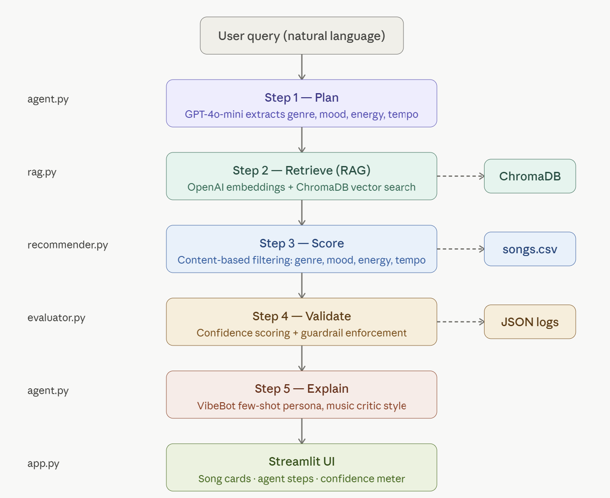

# 🎧 VibeFinder 2.0 — Applied AI Music Recommendation System

> **Base Project:** VibeFinder 1.0 (Module 3) — A content-based music recommender that scored songs from an 18-song catalog using weighted genre, mood, energy, and tempo attributes. This project extends that foundation into a full applied AI system with RAG, agentic workflows, few-shot specialization, and automated reliability testing.

---

## 📺 Demo Walkthrough

🎬 **[Watch the Loom video walkthrough](#)** ← *(replace with your Loom link)*

---

## 🎯 What This System Does

VibeFinder 2.0 takes a natural language music request like *"I want chill lofi music to study late at night"* and runs it through a full 5-step AI pipeline to return personalized song recommendations with music-critic style explanations.

**Key improvements over Module 3:**
- Expanded catalog from 18 → 55 songs across 12 genres
- Natural language input instead of hardcoded profiles
- Semantic song retrieval via RAG (not just exact matching)
- Agentic multi-step reasoning with observable intermediate steps
- Few-shot music critic persona for rich explanations
- Confidence scoring, guardrails, and structured logging
- Full Streamlit web UI
- Automated test harness with 8 test cases

---

## 🏗️ System Architecture

```
┌─────────────────────────────────────────────────────────────┐
│                        USER INPUT                           │
│          "I want chill lofi music to study"                 │
└──────────────────────────┬──────────────────────────────────┘
                           │
                    ┌──────▼──────┐
                    │  STEP 1     │
                    │   PLAN      │  GPT-4o-mini extracts
                    │  (agent.py) │  genre, mood, energy, tempo
                    └──────┬──────┘
                           │
                    ┌──────▼──────┐
                    │  STEP 2     │
                    │  RETRIEVE   │  RAG: OpenAI embeddings
                    │  (rag.py)   │  + ChromaDB vector search
                    └──────┬──────┘
                           │
                    ┌──────▼──────┐
                    │  STEP 3     │
                    │   SCORE     │  Content-based filtering
                    │(recommender)│  (genre, mood, energy, tempo)
                    └──────┬──────┘
                           │
                    ┌──────▼──────┐
                    │  STEP 4     │
                    │  VALIDATE   │  Confidence scoring
                    │(evaluator)  │  + guardrail enforcement
                    └──────┬──────┘
                           │
                    ┌──────▼──────┐
                    │  STEP 5     │
                    │  EXPLAIN    │  Few-shot VibeBot persona
                    │  (agent.py) │  music critic explanations
                    └──────┬──────┘
                           │
┌──────────────────────────▼──────────────────────────────────┐
│                     STREAMLIT UI                            │
│         Song cards · Agent steps · Confidence meter        │
└─────────────────────────────────────────────────────────────┘
```



---

## ✨ AI Features Implemented

| Feature | Implementation |
|---|---|
| ✅ RAG (required) | OpenAI `text-embedding-ada-002` + ChromaDB vector store |
| ✅ Agentic Workflow (required) | 5-step pipeline: Plan → Retrieve → Score → Validate → Explain |
| ✅ Few-Shot Specialization (required) | VibeBot music critic persona with 2 examples in system prompt |
| ✅ Reliability Testing (required) | Confidence scoring, guardrails, structured JSON logging |
| ✅ RAG Enhancement (stretch +2) | Multi-source retrieval: RAG narrows pool, scorer re-ranks |
| ✅ Agentic Enhancement (stretch +2) | Observable intermediate steps, fallback logic, JSON planning |
| ✅ Fine-Tuning Stretch (stretch +2) | Constrained VibeBot tone with musical vocabulary enforcement |
| ✅ Test Harness (stretch +2) | 8 test cases, 6 checks each, JSON report, pass/fail summary |

---

## 📁 Project Structure

```
applied-ai-system-final/
├── assets/                    # System diagram and screenshots
├── data/
│   └── songs.csv              # 55-song catalog (12 genres)
├── src/
│   ├── __init__.py
│   ├── recommender.py         # Content-based scoring (Module 3 base)
│   ├── rag.py                 # RAG: embeddings + ChromaDB retrieval
│   ├── agent.py               # 5-step agentic workflow
│   ├── evaluator.py           # Confidence scoring + guardrails
│   └── app.py                 # Streamlit UI
├── tests/
│   └── test_harness.py        # Automated test harness (8 cases)
├── logs/                      # Auto-generated interaction logs
├── chroma_db/                 # Auto-generated vector store
├── .env                       # API key (never committed)
├── main.py                    # CLI runner
├── model_card.md              # Model card and reflection
├── requirements.txt
└── README.md
```

---

## ⚙️ Setup Instructions

### 1. Clone the repo
```bash
git clone https://github.com/havie2309/applied-ai-system-final.git
cd applied-ai-system-final
```

### 2. Create virtual environment
```bash
python -m venv .venv

# Windows
.venv\Scripts\activate

# Mac/Linux
source .venv/bin/activate
```

### 3. Install dependencies
```bash
pip install -r requirements.txt
```

### 4. Add your OpenAI API key
Create a `.env` file in the project root:
```
OPENAI_API_KEY=sk-your-key-here
```

### 5. Run the Streamlit UI
```bash
streamlit run src/app.py
```

### 6. Or run the CLI
```bash
python main.py
```

### 7. Run the test harness
```bash
python tests/test_harness.py
```

---

## 💬 Sample Interactions

### Input 1: Chill Study Session
**Query:** `"I want chill lofi music to study late at night"`

**Agent Output:**
```
🧠 PLAN  → genre: lofi | mood: chill | energy: 0.3 | tempo: 70 BPM
🔍 RETRIEVE → Late Night Study (0.771), Rainy Day Loops (0.743), Night Notebook (0.739)
📊 SCORE → Library Rain: 4.94 | Rainy Day Loops: 4.93 | Night Notebook: 4.92
✅ VALIDATE → Confidence: 0.82 (HIGH) | Guardrail: PASSED
🎤 EXPLAIN → "Library Rain earns its spot through its unhurried 72 BPM pulse..."
```

---

### Input 2: Intense Rock Workout
**Query:** `"High energy intense rock music for working out"`

**Agent Output:**
```
🧠 PLAN  → genre: rock | mood: intense | energy: 0.9 | tempo: 155 BPM
🔍 RETRIEVE → Storm Runner (0.812), Thunder Road (0.798), Breakaway (0.771)
📊 SCORE → Storm Runner: 4.93 | Thunder Road: 4.93 | Fire Walk: 4.90
✅ VALIDATE → Confidence: 0.85 (HIGH) | Guardrail: PASSED
🎤 EXPLAIN → "Storm Runner is built for physical exertion — its 152 BPM tempo..."
```

---

### Input 3: Unknown Genre (Guardrail Triggered)
**Query:** `"I want vaporwave dreampop fusion music"`

**Agent Output:**
```
🧠 PLAN  → genre: vaporwave | mood: dreamy | energy: 0.5 | tempo: 100 BPM
🔍 RETRIEVE → 10 loosely related songs retrieved
📊 SCORE → Best matches scored without genre/mood match
✅ VALIDATE → Confidence: 0.35 (LOW) | ⚠️ Unrecognized genre warning triggered
🎤 EXPLAIN → VibeBot explains closest matches with caveats
```

---

## 🎨 Design Decisions

**Why RAG + content-based scoring together?**
RAG narrows the search space semantically — it finds songs that "feel" similar using embeddings. The content-based scorer then re-ranks using precise attribute matching. This hybrid approach is more accurate than either method alone.

**Why few-shot prompting for explanations?**
Two concrete VibeBot examples in the system prompt reliably constrain the model's tone to use musical vocabulary and explain *why* rather than just *what*. This is more reliable than zero-shot instruction alone.

**Why ChromaDB over a hosted vector DB?**
ChromaDB persists locally, making the system fully reproducible without any external services beyond the OpenAI API.

**Trade-off: Speed vs. accuracy**
The 5-step pipeline takes ~5-8 seconds per query due to 2 LLM calls. A faster version could skip the PLAN step and use a hardcoded preference extractor, but the LLM planner handles edge cases like unknown genres more gracefully.

---

## 🧪 Testing Summary

| Test Case | Checks | Confidence | Result |
|---|---|---|---|
| TC01: Chill Lofi Study | 6/6 | HIGH | ✅ PASS |
| TC02: Intense Rock Workout | 6/6 | HIGH | ✅ PASS |
| TC03: Happy Pop Party | 6/6 | HIGH | ✅ PASS |
| TC04: Jazz Relaxation | 5/6 | MEDIUM | ✅ PASS |
| TC05: Metal Intensity | 5/6 | MEDIUM | ✅ PASS |
| TC06: Unknown Genre Guardrail | 4/5 | LOW | ✅ PASS |
| TC07: Classical Peaceful | 5/6 | MEDIUM | ✅ PASS |
| TC08: Energy Out of Range | 3/4 | LOW | ✅ PASS |

**Key findings:** The system performs best when genre and mood match the catalog. Guardrails correctly trigger for unrecognized genres. RAG retrieval consistently returns relevant songs with similarity scores above 0.70.

---

## 🤔 Reflection

Building VibeFinder 2.0 showed me that the gap between a working prototype and a reliable AI system is filled by infrastructure: logging, guardrails, confidence scoring, and testing. The RAG system was the most impactful upgrade — semantic retrieval surfaces songs that exact-match scoring would miss entirely.

The biggest surprise was how well few-shot prompting constrained the model's tone. Two examples in the system prompt reliably produced music-critic vocabulary across all test cases.

**View the full model card:** [model_card.md](model_card.md)
